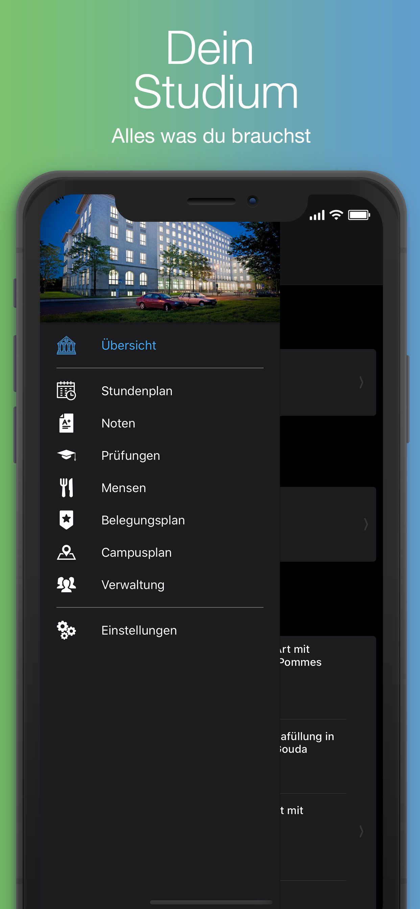
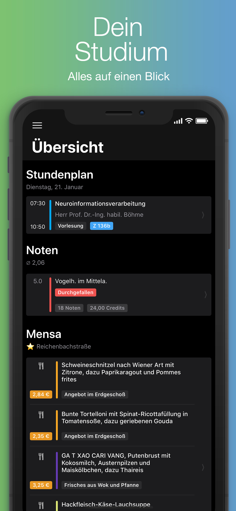
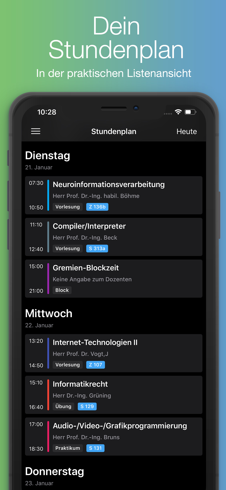
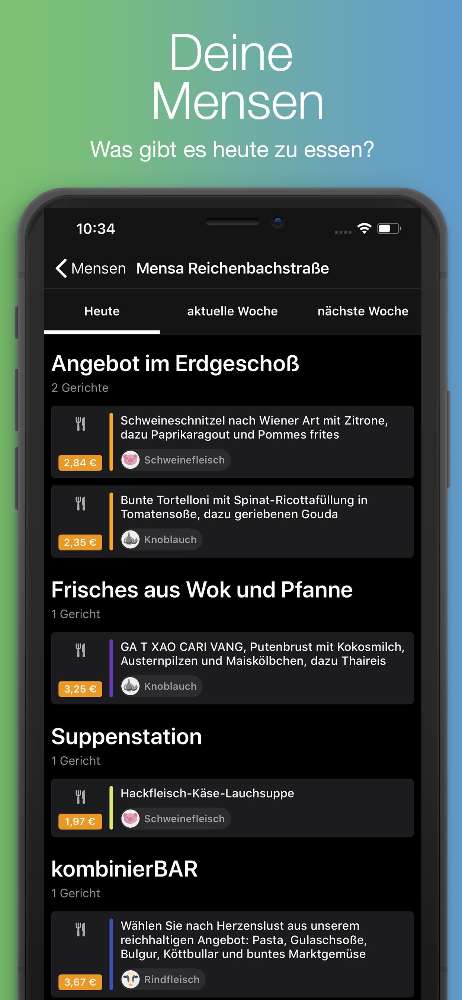
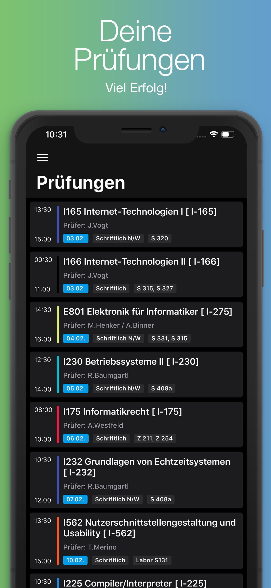

# About
The 'HTW Dresden App' is a student-initiated project that enables students of the [University of Applied Sciences Dresden](https://www.htw-dresden.de/) (HTW) to access their schedule, audit plan, grades and more easily. After some years the management of the HTW decided to continue the development of the app and equalize the featureset of the the apps for iOS and Android to ensure the best user experience.

# Screenshots
 

# Credits
Our credits go to the initiators of this project:
* [BenchR267](https://github.com/BenchR267)
* [fabianehlert](https://github.com/fabianehlert)
* [kiliankoe](https://github.com/kiliankoe)

# Current status
The app is no longer supported. Please use the new webapp "[HTWD mobil](https://mobil.htw-dresden.de/)".
